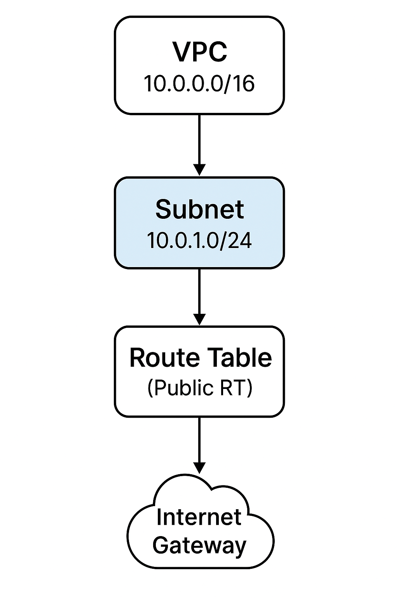

# 🌐 Day 12 – Associate Route Table with Subnet

This project demonstrates how to use **Terraform** to:
1. Create a VPC
2. Create a Subnet
3. Create an Internet Gateway
4. Create a Route Table
5. Associate the Route Table with the Subnet ✅

---
## 📊 Architecture Diagram


## 📂 Project Structure
```
day12-subnet-association/
├── main.tf
├── variables.tf
├── outputs.tf
├── provider.tf
├── terraform.tfvars
└── README.md
```
## 🚀 How to Use

### 1️⃣ Initialize Terraform
```
terraform init
```
### 2️⃣ Validate Configuration
```
terraform validate
```
### 3️⃣ Apply Changes
```
terraform apply -auto-approve
```
### 4️⃣ Check Outputs
```
terraform output
```
## 📊 Outputs

* VPC ID

* Subnet ID

* Route Table ID

* Association ID
## 🧹 Cleanup
```
terraform destroy -auto-approve
```
## 📌 Use Case

In real DevOps projects, **subnet + route table association** is critical for:

* Public Subnets (Internet access)

* Private Subnets (NAT Gateway routing)

* Multi-tier architectures
